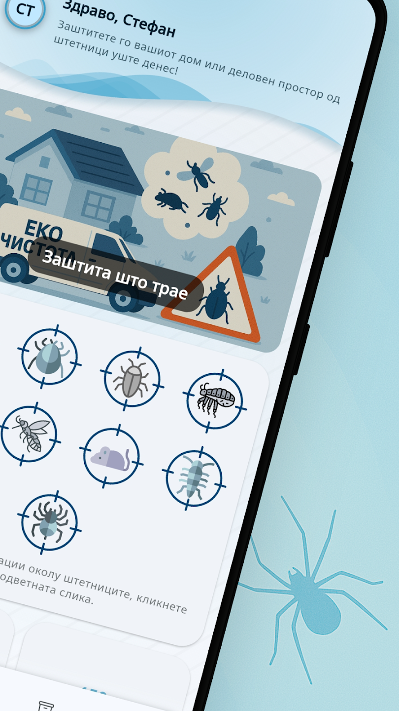
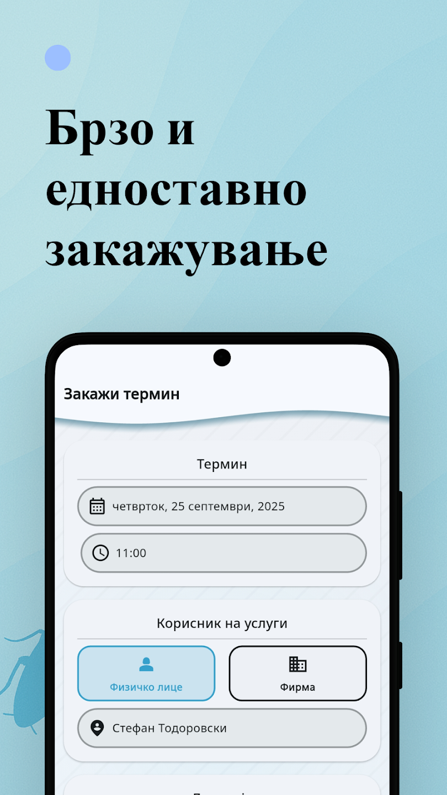
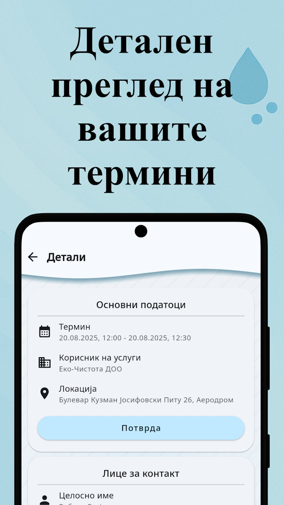

## Overview

**EkoCistota** is a comprehensive Field Service Management (FSM) and client engagement platform developed for a leading provider of Disinfection, Deratization, and Disinsection (DDD) services.

The platform serves as the operational backbone for the company while providing a streamlined mobile portal for customers to schedule treatments, track service history, and manage legally mandated safety documentation.

---

## Project Gallery

_Showcase the interface and system architecture below._

  
  
  

---

## Technical Core & Responsibilities

### 🏗️ Architecture & Infrastructure

- **Monorepo Strategy:** Implemented a sophisticated monorepo using **NX (Nest.js)** and **Melos (Flutter)**. This ensured high code reusability across shared libraries and allowed for rapid deployment of future platform tenants.
- **Clean Architecture:** Applied Domain-Driven Design (DDD) principles to maintain a highly decoupled and testable codebase.
- **Database Design:** Designed a relational **PostgreSQL** schema optimized for multi-tenant data structures, with **SQLite (Drift)** for robust offline-first mobile capabilities.

### 🛠️ Key Features Engineered

- **Booking & Scheduling System:** Developed an extensible engine with full support for **RRULEs (Recurrence Rules)**, resource allocation, and real-time availability tracking.
- **Dynamic Report Generator:** Built a template-driven generator based on OpenOffice documents. It utilizes dynamic data injection to automate the creation of legally compliant DDD certificates.
- **Unified Notification Service:** Created a centralized service to orchestrate multi-channel communications (Firebase Cloud Messaging and Email) via a single API.
- **E-commerce Engine:** Architected a modular booking and commerce engine from scratch, designed to be repurposed for various service-based industries.

---

## Tech Stack

### Frontend (Mobile & Web)

- **Language:** Dart
- **Framework:** Flutter
- **State Management:** Riverpod, Get_it, Streams
- **Routing & Persistence:** Go_router, Drift (SQLite)

### Backend

- **Language:** TypeScript
- **Framework:** Nest.js
- **ORM:** MikroORM
- **Auth:** Supertokens
- **API:** REST

### Infrastructure & Tools

- **DevOps:** GitLab CI/CD, NX, Melos
- **Services:** Firebase (Analytics, Crashlytics, FCM), Google Calendar API
- **Other:** OpenOffice Integration, Isolates for heavy processing

---

## Impact

Contributed to the full product lifecycle, from requirements gathering to technical and design decisions, driving full-stack execution. The system transformed a manual, paper-based workflow into a fully digital, legally compliant enterprise solution.

> [!NOTE]
> This project demonstrates the ability to handle complex, highly regulated industries by combining robust backend logic with user-centric mobile design.
