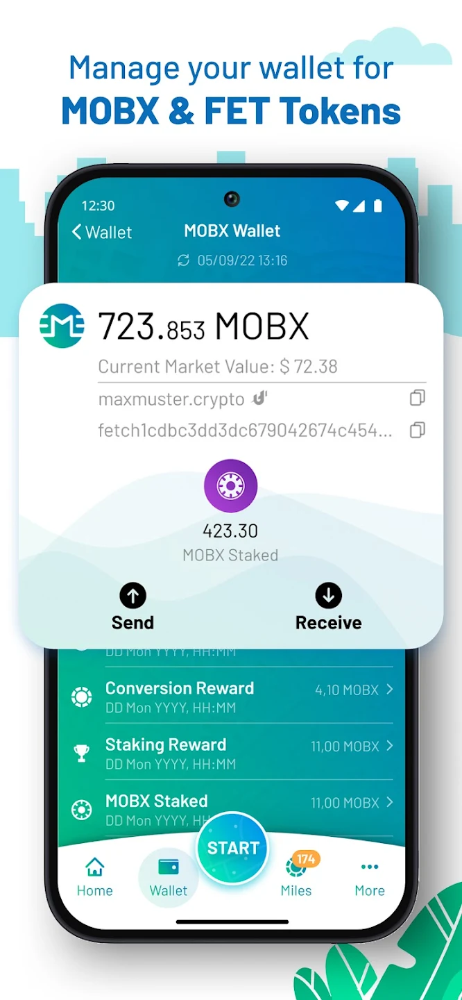
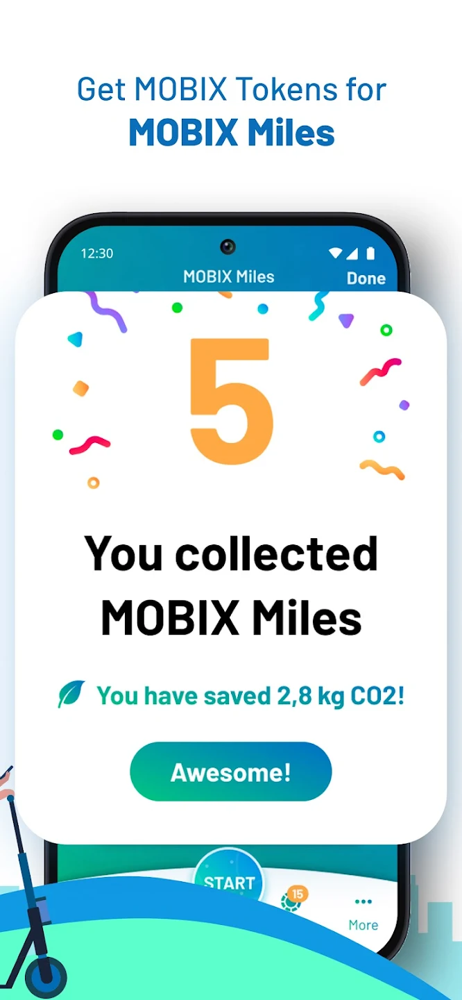
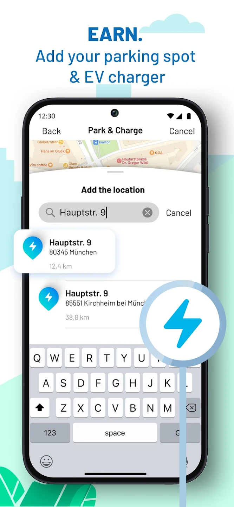
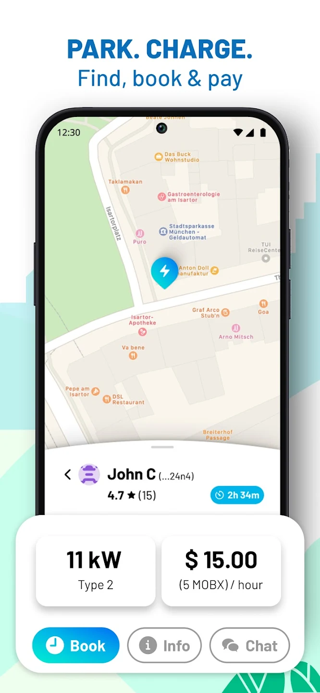
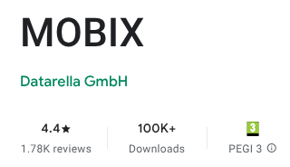

## Overview

**MOBIX** is a decentralized "Move-to-Earn" (M2E) ecosystem that incentivizes sustainable urban mobility. By rewarding users for choosing eco-friendly transportation over CO2-emitting vehicles, MOBIX turns green habits into real-world financial value through the **$MOBX** token on the **Fetch.ai (Cosmos)** network.

---

## Technical Showcases

  
  
  
  

---

## My Role & Contribution

As a **Full-Stack Software Engineer**, I played a pivotal role across the mobile and backend layers, transitioning the product from a native Android application to a unified cross-platform Flutter architecture while scaling the supporting NestJS infrastructure.

### 🏗️ Mobile Architecture & Migration

- **Native to Flutter Transition:** Led the strategic migration from a native Kotlin codebase to **Flutter**, achieving feature parity across iOS and Android while reducing maintenance overhead by 50%.
- **Clean Architecture:** Implemented a robust architecture using **Riverpod** for state management and **Drift** for local persistence, ensuring the app remained performant despite complex background processing.
- **Background Resilience:** Engineered a persistent background tracking service optimized to bypass aggressive OEM battery savers (Samsung, Huawei) while maintaining a low memory footprint.

### 🛡️ Anti-Fraud & Security

- **Multi-Layered Validation:** Developed a sophisticated anti-fraud system integrating **Play Integrity API** and **hCaptcha**.
- **Sensor Fusion:** Created a custom GPS spoofing detector that cross-references location data with raw **accelerometer and gyroscope** inputs to validate physical movement.
- **Hardware Encryption:** Secured user mnemonic phrases using the **Android Keystore**, ensuring private keys are hardware-encrypted and non-extractable.

### ⛓️ Web3 & Blockchain Integration

- **Non-Custodial Wallet:** Built a full-featured wallet within the app for managing, staking, and swapping **$MOBX** and **$FET**.
- **Performance Engineering:** Replaced legacy REST/long-polling with **gRPC**, **Protobufs**, and **WebSockets** to interact with the Cosmos SDK, significantly reducing latency and ensuring strict type safety.

### 🔌 Backend & Infrastructure

- **Full-Stack Alignment:** Stepped in as a **NestJS** developer to synchronize mobile security protocols with server-side validation, ensuring the integrity of the reward distribution lifecycle.

---

## Tech Stack

| Category     | Technologies                                                       |
| :----------- | :----------------------------------------------------------------- |
| **Mobile**   | Flutter, Dart, Riverpod, Kotlin, Coroutines, Jetpack Compose, Room |
| **Backend**  | NestJS, TypeORM, PostgreSQL, RabbitMQ, gRPC, GraphQL               |
| **Web3**     | Cosmos SDK, Fetch.ai, Protobufs, Non-custodial Wallet              |
| **DevOps**   | GitLab CI/CD, Kubernetes, Fastlane, Grafana                        |
| **Services** | Firebase, Play Integrity, hCaptcha, Activity Recognition API       |

---

## Key Challenges Overcome

> **Challenge:** High network latency caused UI hangs during blockchain transaction processing.
> **Solution:** I re-engineered the transaction lifecycle from a pull-based model to an event-driven architecture using **WebSockets** and **Room**. This allowed for real-time status updates without redundant API calls, creating a seamless user experience even during network congestion.

---

🎉 **100k+ downloads!**

Mby the app is going to be removed from the stores so lets just keep this here ;p
  
