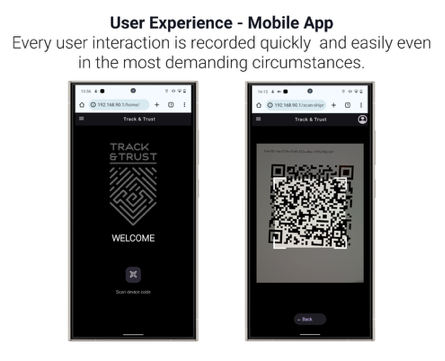
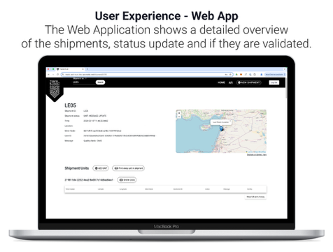

## 🛰️ Project Overview

**Track & Trust** is a high-resolution tracking solution designed to provide 360° visibility in supply chain logistics, even in environments with zero traditional connectivity. By leveraging satellite communication, IoT mesh networks, and blockchain technology, it ensures that shipment data remains authentic, immutable, and accessible anywhere on Earth.

This project was developed with support from the **European Space Agency (ESA)** to address critical gaps in humanitarian aid logistics and emergency preparedness.

-----

## 🛠️ Technical Ecosystem

### Backend & Data

  * **Server/Client Side Architecture:** Built with a robust **NestJS** backend for high-concurrency data orchestration.
  * **Database:** **PostgreSQL** handles complex relational data for shipment history and user management.
  * **Blockchain:** Immutable ledger integration for tamper-proof transaction recording.

### The "Hardware" Mesh

The backbone of the offline network consists of custom-engineered **Mesh Nodes**:

  * **Hardware:** Raspberry Pi units upgraded with long-range antennas, custom adapters, and high-capacity battery packs for field deployment.
  * **Interface:** Each node runs a **Svelte**-based local dashboard, allowing for lightweight, high-performance interaction directly at the edge.

-----

## 📱 User Experience & Interfaces

### 1\. Mobile Webview: Rapid Field Interaction

The mobile interface is designed for speed and reliability. Using a specialized webview, field agents can record handoffs in seconds.

  * **QR Integration:** Instant container scanning to trigger status updates.
  * **Offline Sync:** Interactions are cached locally on the device or mesh node until a satellite or cellular uplink becomes available.

> **Showcase:** \> 
> *Caption: The mobile webview interface showing the "Scan & Record" workflow for container interactions.*

### 2\. Web Application: Command & Control

The central web dashboard provides stakeholders with a "God-view" of the entire supply chain.

  * **Shipment Overview:** Real-time tracking of all active containers.
  * **Validation Status:** Visual indicators showing if a shipment update has been successfully validated and recorded on the blockchain.
  * **Status History:** A detailed, chronological log of every interaction point.

> **Showcase:** \> 
> *Caption: The administrative dashboard showing global shipment status and blockchain validation logs.*

-----

## ✨ Key System Highlights

  * **Network Resilience:** IoT-Mesh with Satellite backup (GNSS metadata integration).
  * **Offline Capacity:** Secure data storage until connectivity is restored.
  * **Single Point of Truth:** Authentic data stored immutably in the blockchain.
  * **Privacy-Preserving:** State-of-the-art encryption for all shipment metadata.

-----

## 🚀 Space Added Value

The core innovation lies in the integration of space technologies. By utilizing satellite terminals, we facilitate humanitarian aid in regions with destroyed or non-existent infrastructure. This ensures vital supplies are tracked and accounted for, providing peace of mind to donors and coordinators alike through GNSS-verified location data.